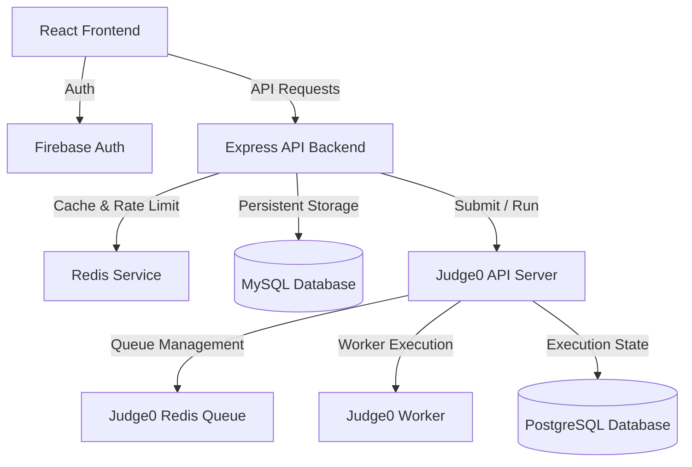

# Code Runner - Full-Stack Online Judge System

Code Runner is a complete, production-ready Online Judge platform. It features a React-based interactive frontend, a Node.js/Express REST API backend, and local or remote code execution powered by Judge0. 

---

## 🔗 Live Demo
* **Live Link:** `[Insert Live Demo Link Here]` *(Link will be added later)*

---

## 📸 Screenshots & Reference Visuals
*(Screenshots and visual assets will be updated later)*

| **User Dashboard** | **Coding Arena (Monaco Editor)** |
|:---:|:---:|
| `[Upload User Dashboard Screenshot Here]` | `[Upload Monaco Editor Coding Arena Screenshot Here]` |

| **Admin Portal** | **Contest Management** |
|:---:|:---:|
| `[Upload Admin Portal Screenshot Here]` | `[Upload Contest Management Screenshot Here]` |

---

## 🎥 Video Demo & Walkthrough
* **Walkthrough Video:** `[Insert YouTube / Loom Walkthrough Link Here]` *(Video link will be added later)*

---

## 🚀 Key Features

### 👤 User Roles & Authentication
* **Role-Based Access:** Supported roles include **Admin**, **Moderator**, and **Contestant**.
* **Firebase Authentication:** Secure login using **Google Sign-In** or traditional **Email & Password** authentication.
* **Profile Syncing:** Automatic user profile synchronization into the local MySQL database upon first login. Admin role auto-promotion for designated platform owners.

### 🏆 Contest & Group Management
* **Flexible Contests:** Schedule and configure contests with specific start times, durations, and problem sets.
* **Access Control:** Contests can be public or restricted to specific user groups or allowed lists.
* **Group Management:** Organise contestants into groups for targeted permissions, assignments, or analytics.

### 📝 Problem & Test Case Arena
* **CRUD Management:** Administrators and Moderators can create, view, modify, or delete coding challenges.
* **Test Cases:** Support for up to 10 test cases per problem with flexible input, expected output, and visibility control (public or hidden).
* **Constraints & Solutions:** Include constraints (time limits, memory limits) and official code solutions for reference.

### 💻 Interactive Practice Arena
* **Monaco Editor:** Integrated advanced IDE-like editor with syntax highlighting and auto-completion.
* **Real-time Compilation & Run:** Compile code instantly against sample test cases.
* **Submissions & Verdicts:** Submit code for full evaluation against hidden test suites. Receive detailed verdicts (e.g., *Accepted*, *Wrong Answer*, *Time Limit Exceeded*, *Compilation Error*) with breakdown statistics.

### 📢 System Activity & Broadcasts
* **Admin Activity Logs:** Transparent logging of administrative actions (e.g., user modifications, problem creations, system actions).
* **Notice Board:** Broadcast notices or critical announcements directly to user dashboards.

---

## 🏗️ Architecture & Technology Stack



* **Frontend:** React 18, Vite, Tailwind CSS, Monaco Editor (`@monaco-editor/react`), React Router DOM
* **Backend:** Node.js, Express, MySQL 8.0 (`mysql2` with connection pool and migrations), Redis (caching and request rate limiting)
* **Execution Engine:** Judge0 1.13.0, PostgreSQL 16 (for Judge0 state), Redis 7 (queue management)

---

## 🐳 Quick Start with Docker (Recommended)

The easiest way to spin up the entire stack locally (frontend, backend, database, redis, and a private Judge0 instance) is using **Docker Compose**.

### Prerequisites
* [Docker Desktop](https://www.docker.com/products/docker-desktop/) (which includes Docker Compose)

### Launch instructions
1. Clone the repository and navigate to the project directory:
   ```bash
   git clone <repository-url>
   cd code_runner
   ```
2. Build and start all services in detached mode:
   ```bash
   docker compose up -d
   ```
3. Access the portals:
   * **Frontend:** [http://localhost:5173](http://localhost:5173)
   * **Backend API:** [http://localhost:5000](http://localhost:5000)
   * **Judge0 API:** [http://localhost:2358](http://localhost:2358)

---

## 🛠️ Manual Local Setup

If you prefer to run the services outside Docker, follow these instructions.

### 1. Prerequisites
* **Node.js** v18+
* **MySQL** v8.0+
* **Redis** v6.0+
* A running **Judge0** instance (or public endpoint)

### 2. Database Initialization
Create a MySQL database named `code_judge_mvp` and run the schema setup:
```bash
# Using command-line MySQL client
mysql -u root -p -e "CREATE DATABASE code_judge_mvp;"
mysql -u root -p code_judge_mvp < backend/database/schema.sql
```

### 3. Backend Setup
1. Navigate to the backend directory and copy the environment file:
   ```bash
   cd backend
   cp .env.example .env
   ```
2. Configure `.env` with your database credentials and Judge0 credentials:
   ```env
   PORT=5000
   DB_HOST=localhost
   DB_USER=root
   DB_PASSWORD=your_root_password
   DB_NAME=code_judge_mvp
   DB_PORT=3306
   REDIS_URL=redis://127.0.0.1:6379
   ```
3. Install dependencies and start the developer server:
   ```bash
   npm install
   npm run dev
   ```

### 4. Frontend Setup
1. Open a new terminal window, navigate to the frontend directory:
   ```bash
   cd frontend
   ```
2. Install dependencies and run the client:
   ```bash
   npm install
   npm run dev
   ```
3. The frontend is accessible at [http://localhost:5173](http://localhost:5173).

---

## 🌐 Deployment to AWS EC2

The project features a automated CI/CD pipeline targeting an AWS EC2 instance. The workflow is configured in [.github/workflows/deploy.yml](file:///.github/workflows/deploy.yml).

### CI/CD Workflow Summary
On every push to the `main` branch, the GitHub Actions runner:
1. Builds optimized Docker images for the Frontend and Backend services.
2. Pushes the Docker images to Docker Hub.
3. Transmits files (`docker-compose.yml`, configuration folders, and assets) to the EC2 host via Secure Copy Protocol (SCP).
4. Connects via SSH to log in, pull the fresh images from Docker Hub, and execute:
   ```bash
   sudo docker compose pull
   sudo docker compose up -d --remove-orphans --no-build
   sudo docker image prune -f
   ```

### Initial AWS EC2 Host Configuration
To prepare your EC2 instance for target deployment:
1. **Launch EC2 Instance:** Use an Ubuntu Server AMI (t2.medium or higher recommended for running Judge0 and compiler engines).
2. **Install Docker & Docker Compose:**
   ```bash
   sudo apt-get update
   sudo apt-get install -y docker.io docker-compose-v2
   sudo systemctl start docker
   sudo systemctl enable docker
   sudo usermod -aG docker $USER
   ```
3. **Open Security Group Ports:**
   * `80` (HTTP) / `5173` (Frontend Web UI access)
   * `443` (HTTPS)
   * `22` (SSH)

### Configuring GitHub Secrets
Add the following credentials to your repository under **Settings > Secrets and variables > Actions**:

| Secret Key | Description |
| :--- | :--- |
| `DOCKERHUB_USERNAME` | Your Docker Hub account ID |
| `DOCKERHUB_TOKEN` | A personal access token generated on Docker Hub |
| `EC2_HOST` | The public IPv4 address or DNS record of the EC2 instance |
| `EC2_USERNAME` | The SSH login user (usually `ubuntu`) |
| `EC2_SSH_KEY` | The private PEM key (`.pem`) used to authenticate SSH connection |
